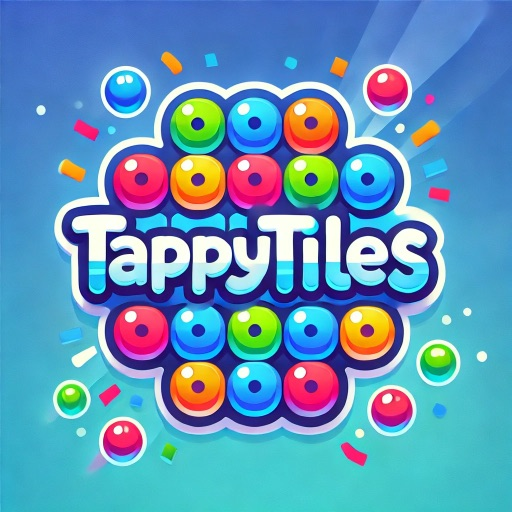

# TappyTiles 🎉

Un semplice gioco in *React + Vite* con animazioni! 🎨✨

## Come funziona?
- Scegli un tema e inizia a giocare!
- Tocca le 10 tessere nel giusto ordine per rivelare i personaggi.
- Se sbagli, la tessera diventa rossa.
- Se completi il gioco, le tessere ballano e parte un’esplosione di coriandoli! 🎊

## Tecnologie utilizzate
- 🚀 Vite
- 🎨 Tailwind CSS
- 🕺 Framer Motion – per animazioni giocose
- 🎊 Canvas-Confetti – per graficare in caso di vittoria